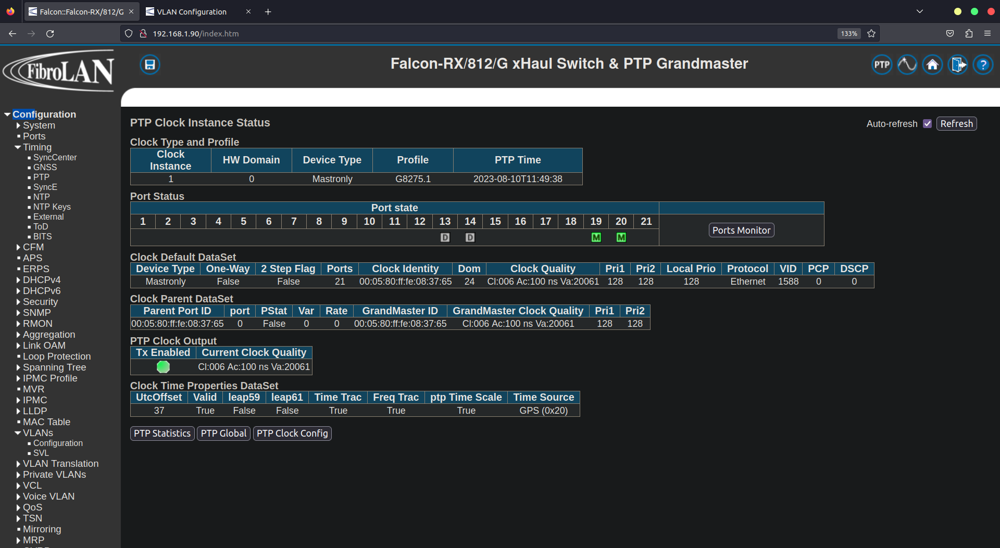
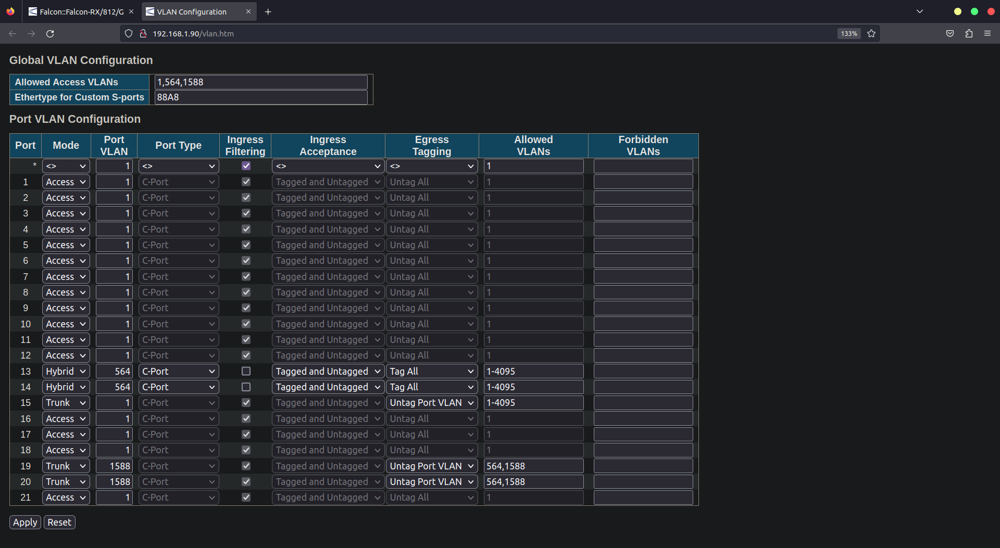

# Falcon test with OAI-liteon C3 with vlan 564

## General Information
* Vlan 564 for C/U plane
* Default Vlan for PTP packets
* Port 19 connected to Liteon O-RU
* Port 20 connected to O-DU sever

## Modifications
* Use mode trunk with untag port vlan
* Set port vlan anything other than 564(564 used for c/u plane). 
* Used vlan 1588 and can use anything other 564
* Added 1, 564, 1588 in general allowed vlans 
* Added only 564 & 1588 in allowed vlans and nothing else
* Added vid 1588 in ptp config

## PTP configuration:

## VLAN configuration:

