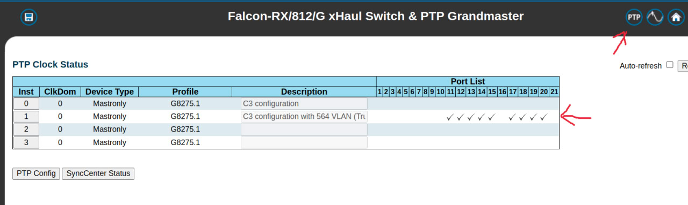
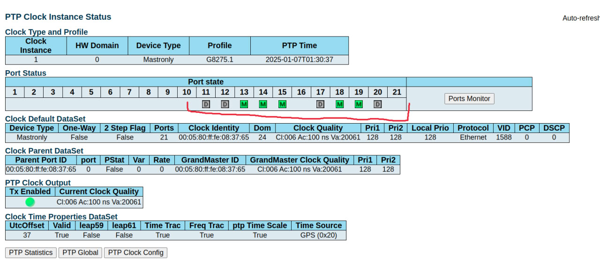
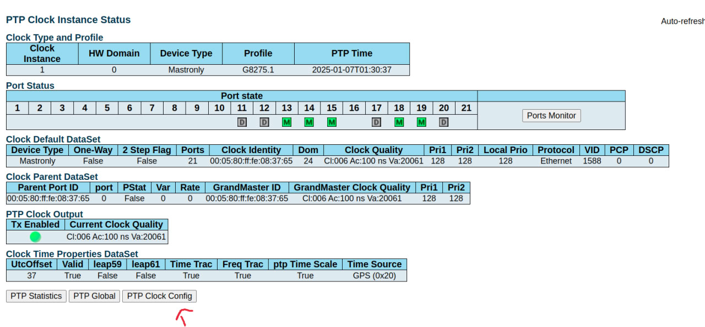
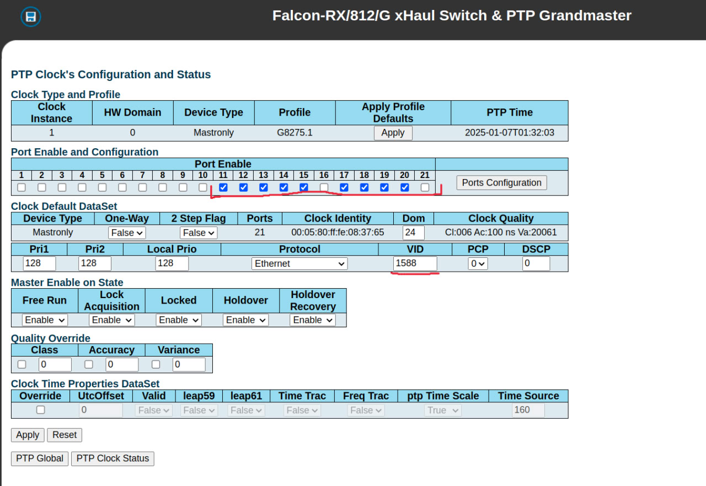

# Falcon test with OAI-liteon C3 with vlan 564

## General Information
* Vlan 564 for C/U plane
* Default Vlan for PTP packets

> You can use any port(in current scenario Port 19 and 20 are being used)

* Port 19 connected to Liteon O-RU
* Port 20 connected to O-DU sever

## PTP Clock configuration

Click on the PTP icon at the top right corner.
It will show the list of PTP Clock Instances. For now you can use Instance 1 or you can create your own instance as well.

Click on the Instance 1 and in the port state you can see the list of added of ports meaning this profile will be added to the following ports.

 In case you want to use another port that is not added in the instance then click on `PTP Clock Config`

Just tick the port that you want to add. Also make sure you have added a VID(this will also be used in the vlan configuration), in  this case VID 1588 is being used.

Then click on apply.

## VLAN configuration:
* Use mode trunk with untag port vlan
* Use vlan 1588(that was set in VID for ptp clock instance) and can use anything other 564(because 564 will be used for liteon c-u plane packets)
* Added 1, 564, 1588 in general allowed vlans
* Added only 564 & 1588 in allowed vlans and nothing else for port 19 and 20

