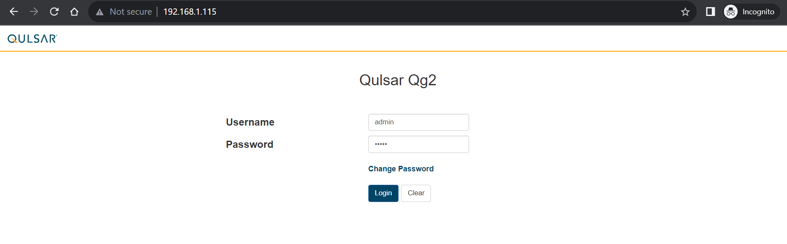
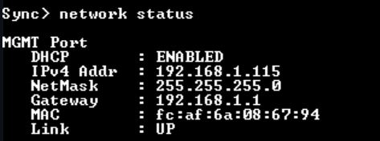
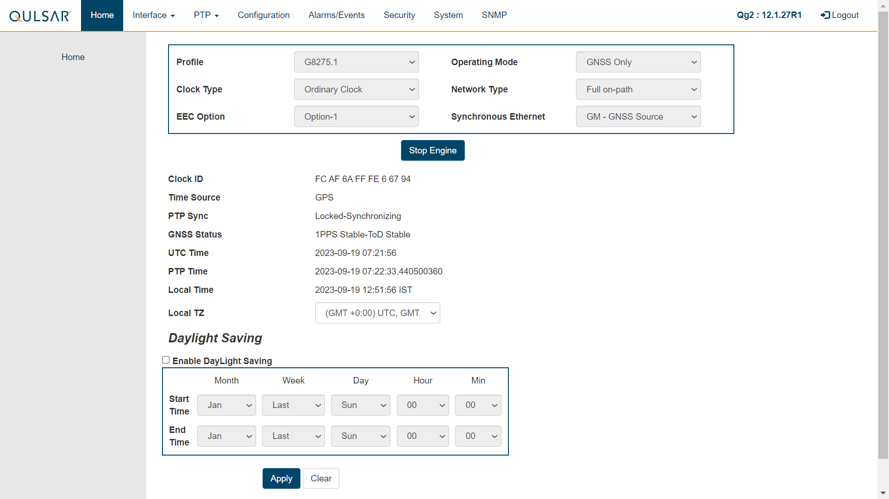
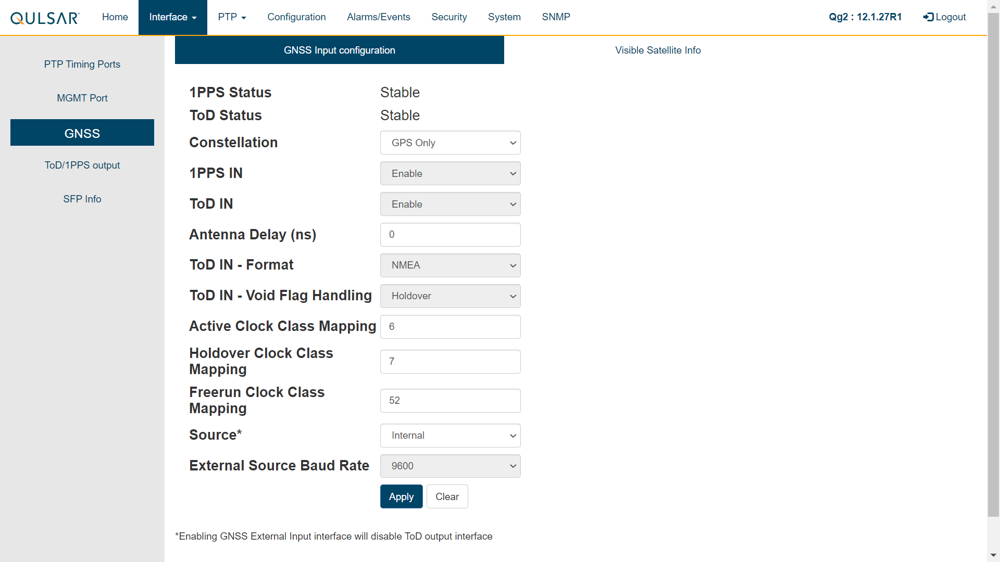
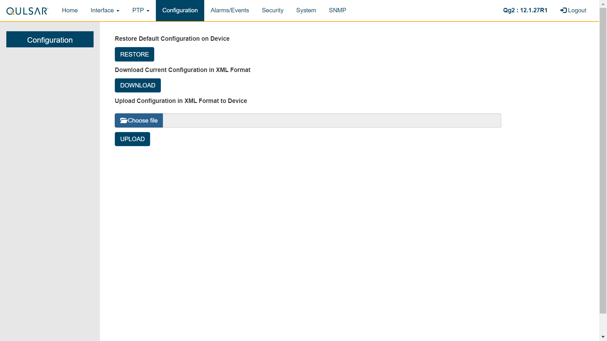
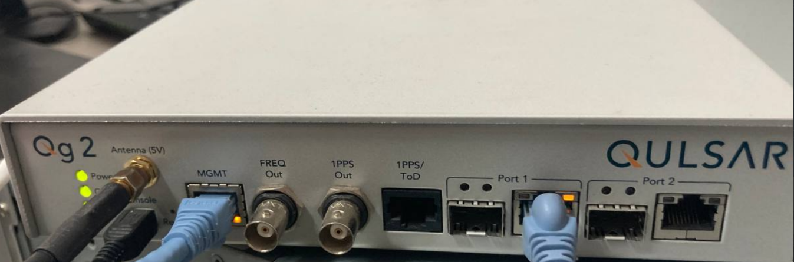
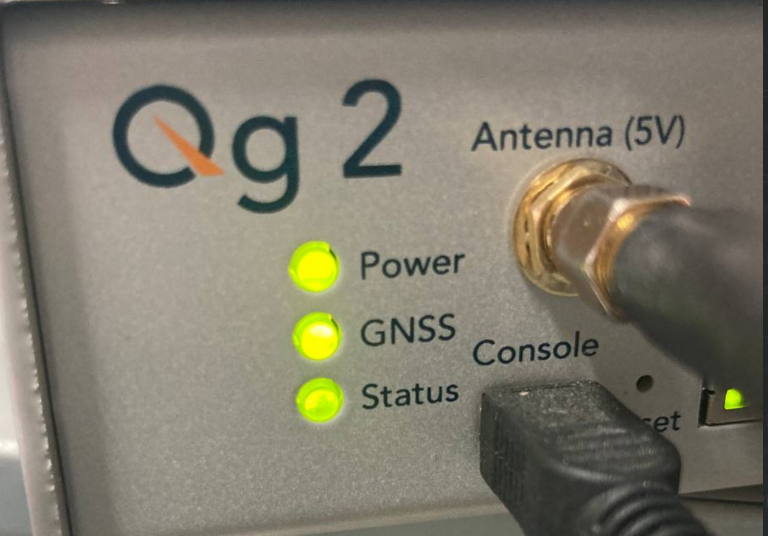

# Qulsar_Qg2

### 1. Login with `username` and `password` as **`admin`**

> **NOTE**: If you want to enable the DHCP, open the terminal of Qulsar using **TeraTerm**, login with same username and password, and run the following cmd: `network configure dhcp`. This will enable DHCP and assign IP to access web console. See the assigned IP using `network status`. 

### 2. Qulsar **Home Screen**

### 3. Update the configuration of **GNSS** like this: 

### 4. Upload the **config** file for Qulsar

### 5. Physical Setup of Qulsar

### 6. Qulsar successful output

